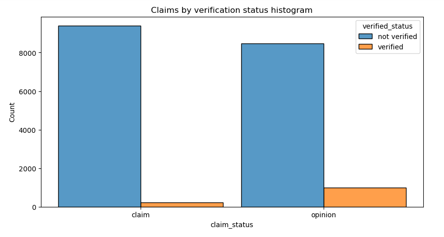
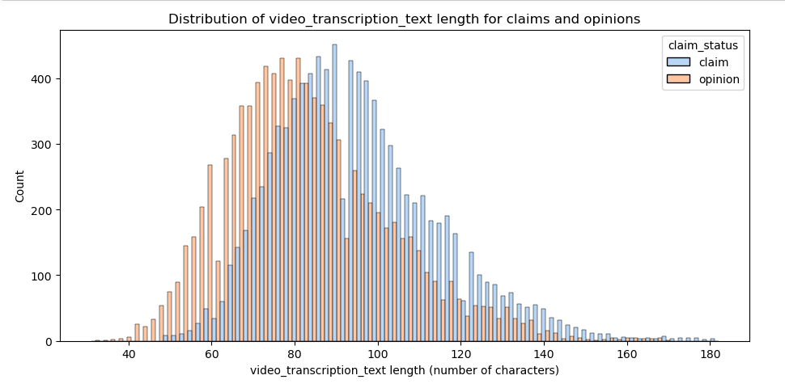
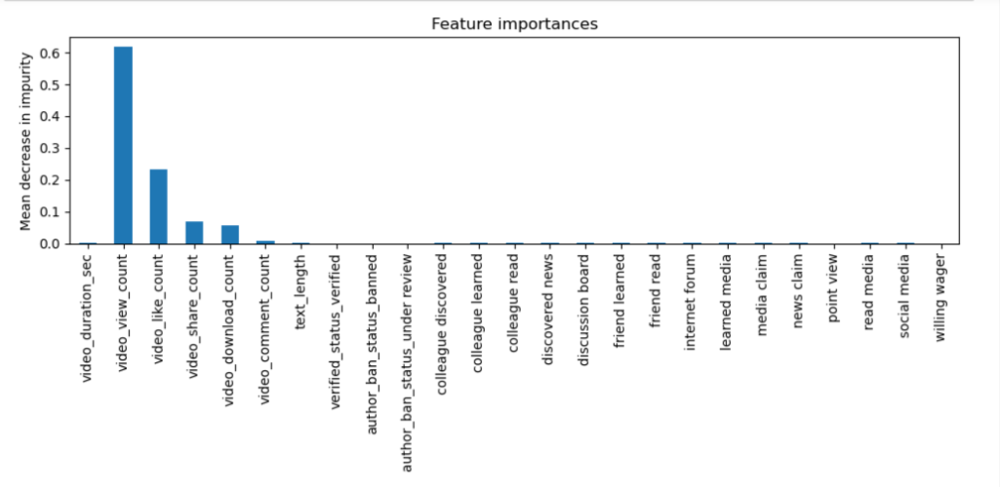

# Classifying TikTok Videos Using Machine Learning

**Overview**

This project aimed to create an XGBoost and random forest model to help identify claims and opinions. The final random forest model was performed with 99% accuracy. Based on the model, the video_view_count,	video_like_count,	video_share_count, and video_download_count were most influential in determining whether a TikTok video presents a "claim" or presents an "opinion".

The purpose of this model is to mitigate misinformation in videos on the TikTok platform. With a successful prediction model, TikTok can reduce the backlog of user reports and prioritize them more efficiently.

**Business Understanding**

TikTok users can report videos that they believe violate the platform's terms of service. Because there are millions of TikTok videos created and viewed every day, this means that many videos get reported—too many to be individually reviewed by a human moderator. Analysis indicates that when authors do violate the terms of service, they're much more likely to be presenting a claim than an opinion. Therefore, it is useful to be able to determine which videos make claims and which videos are opinions. Videos that are labeled opinions will be less likely to go on to be reviewed by a human moderator. Videos that are labeled as claims will be further sorted by a downstream process to determine whether they should get prioritized for review. For example, perhaps videos that are classified as claims would then be ranked by how many times they were reported, then the top x% would be reviewed by a human each day.

**Data Understanding**

The data consisted of approximately 19,382 observations and 12 features. Each row represents a distinct TikTok video that presents either a claim or an opinion and the accompanying metadata about that video. The features included information on the video duration, video transcription, views count, likes count, and verified status. The bar chart below shows the combination of claim status and verification status.

Approximately 50.3% of the dataset represents claims and 49.7% represents opinions, so the outcome variable is balanced. In connection with this, a feature was engineered to represent the distribution of video_transcription_text length for claims and opinions.

**Modeling and Evaluation**

A random forest model comprising 200 decision trees determined feature importance. The plot below shows that trip duration, distance, and fare cost were the Top 3 most important factors in determining a generous tipper from a non-generous one. The overall model performed with 99% accuracy and 99% precision.

**Conclusion**

This model can benefit TikTok human moderators by reducing the backlog of user reports and prioritizing them more efficiently. This machine learning model would greatly assist in the effort to present human moderators with videos that are most likely to violate TikTok's terms of service.
